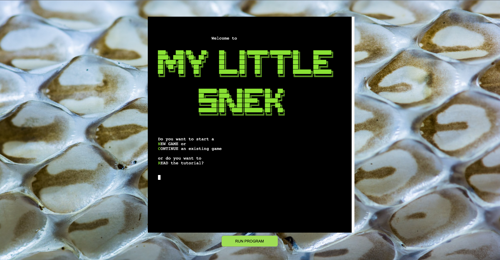
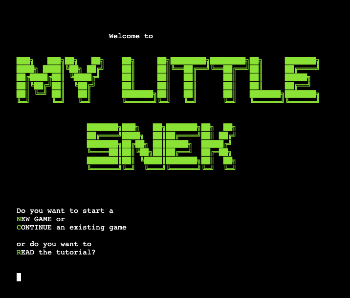
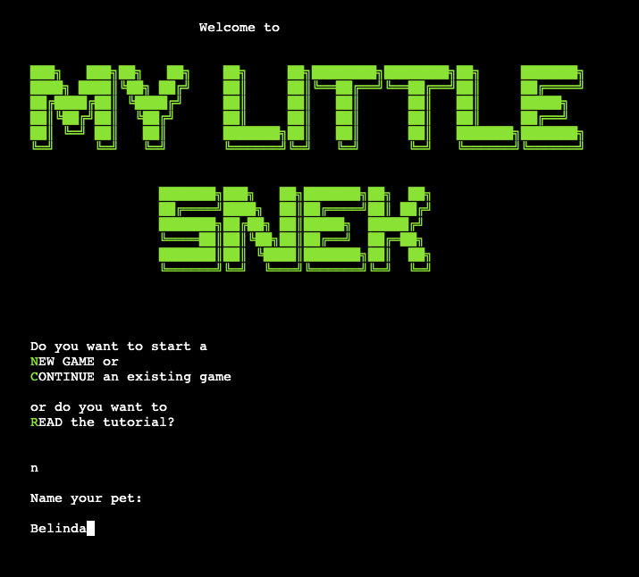
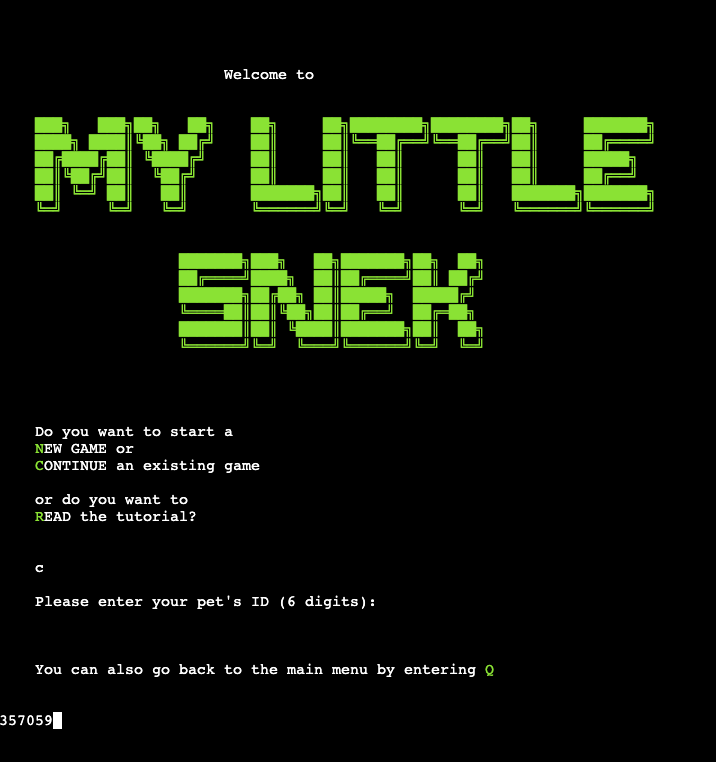
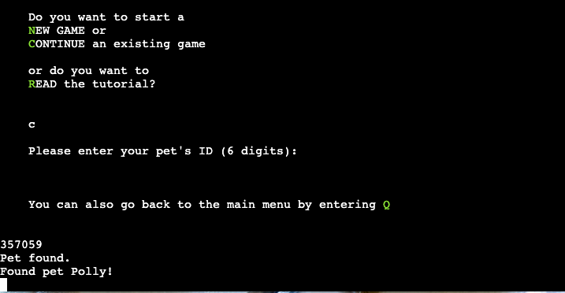
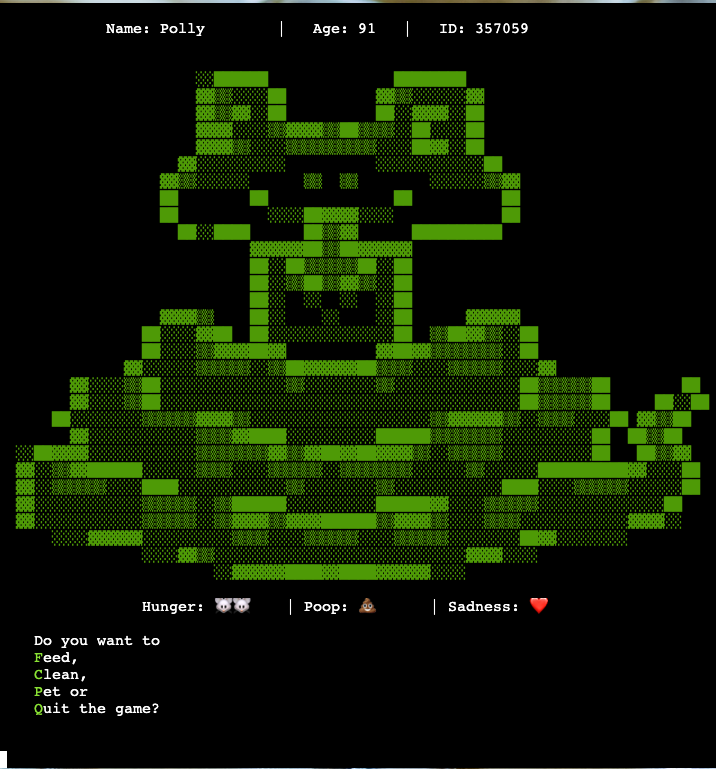

# my little Snek

my little Snek is a game inspired by the popular virtual pet called Tamagotchi. In this game, you have a virtual pet which has different needs that you need to take care of.
The objective is to have the pet last as long as possible. Throughout the game, the pet evolves into bigger and bigger stages. 

Since the game was developed using the programming language Python, I deemed it fitting to make the pet a snake. 

The deployed game can be found here: [my little Snek](https://my-little-snek.herokuapp.com/)

## Table of Contents
- my little Snek
- Table of Contents
- Features
    - User Stories
    - Implemented Features - MVP
      - Additional Features
    - Potential Future Features
- Design
    - Flowchart
    - Technologies
      - Libraries
    - Classes
    - Data Storage
- Testing
    - Bugs
    - Validation
    - Manual Testing
- Deployment
- Credits

## Features

### User Stories

1. As a new user I want to have a pleasant experience when opening a game
2. As a returning user I want to be able to recognize the program I have visited before
3. As a new and returning user, I want to know what input options I have
4. As a new user, I want to be able to start a game
5. As a returning user, I want to be able to continue a game from a previous session
6. As a user, I want a personalized experience
7. As a user, I want a clear interface where I can see the game status and the input options at any time
8. As a user, I want to see how the game progresses
9. As a user, I want to be able to interact with the game at any time
10. As a user, I want to be informed of incorrect input

### Implemented Features - MVP

| **Feature**                                                       | **Solves User Story** |
|-------------------------------------------------------------------|-----------------------|
| [Display Welcome Screen](#display-welcome-screen)                 | 1, 2, 3               |
| [Start New Game](#start-new-game)                                 | 4, 6, 7               |
| [Load Existing Game](#load-existing-game)                         | 5                     |
| [Display Game](#display-game)                                     | 7                     |
| [Run and Progress Over Time](#run-and-progress-over-time)         | 8                     |
| [Accept Non-Blocking User Input](#accept-non-blocking-user-input) | 9                     |
| [Pet Functions](#pet-functions)                                   | 9                     |
| [Autosave in Regular Intervals](#autosave-in-regular-intervals)   | 5                     |
| [Validate Input](#validate-input)                                 | 10                    |

##### Display Welcome Screen 

At the start of the program, the game displays a welcome screen that shows different options to choose from. 

The welcome screen's purpose is to make sure the player feels welcome and a returning player recognizes the game from previous sessions. 

The options the player is presented with are to start a New game, Continue an existing game or to Read the tutorial. The upper case letters, which are also highlighted in a light green color, are the commands the player can use to make their choice. 

##### Start New Game 

If the player chooses the option to start a new game, they are asked to choose a name for their new pet. 
The input is validated to only accept a name made up of letters and a length between 2 to 10 characters. See more about validation in the [section below](#validate-input). 

The idea is that the user bonds a little more with the pet if they can give it a name of their choosing, as opposed to having a random name or unnamed pet. It also personalizes the game experience for the user. 

After the player has input the pet's name, the program will [display the game](#display-game).

##### Load Existing Game

If the player chooses the option to continue an existing game, they are asked to provide the 6 digit ID of the pet. 
The input is validated to check if it conists of exactly 6 characters and to also check if all characters are numbers. See more about validation in the [section below](#validate-input). 

The ID is generated automatically on a new game with 6 random digits to make sure people cannot just guess someone else's pet's ID. 

After the player has input the pet's ID, the program will give appropriate feedback about the input.

It will then proceed to [display the game](#display-game).
The player also has the option to go back to the main menu by entering "Q". 

Offering a player the option to continue a game they had started earlier, requires to save the data somewhere. In the case of my little Snek, the data is saved in a Google Sheet and retrieved from there or updated when needed. I will talk more about this below in the section about [Data Storage](#data-storage).

##### Display Game

The main game display is split into two essential parts:

1. Display the Pet and it's properties
    - Name
    - Age
    - ID
    - Stage
    - Hunger
    - Poop
    - Sadness
2. Display Input Options
    - Pet Functions
    - Quit Game

This way, the player has all the information they need at their disposal at any point during a running game. 

The pet display is using text art and emoji characters to make it more pleasing and easier to grasp the content. 

The input options are highlighted in the same way as in the Welcome Screen, to ensure consistency and to make it easy to see which options are available.

##### Run and progress over time
##### Accept non-blocking user input
##### Pet Functions
- Feed 
- Pet
- Clean
- Die under specified conditions
##### Autosave in regular intervals
##### Validate input

#### Additional Features

### Potential Future Features

## Design

### Flowchart
### Technologies
#### Libraries

Standard Libraries used:
- os -> Used to clear the terminal
- random -> Used to generate random numbers for ID generation and chance of property changes
- threading -> Used to create simultaneous threads for non-blocking user input and "ticking" to progress the game
- time -> Used in several places to have a delay on functionalities (time.sleep()), used in the ticking function 

Custom Libraries used:
- colorama -> Used to print different colors in the terminal to make the experience more visually pleasing and to highlight input options
- emoji -> Used to display emojis for the pet's properties
- gspread -> Used to access a Google Sheet to store the pet data
- google.oauth2.service_account -> Used to authenticate towards Google's API
  
### Classes
### Data Storage
## Testing
### Bugs
### Validation
### Manual Testing
## Deployment

To read:
https://medium.com/vaidikkapoor/understanding-non-blocking-i-o-with-python-part-1-ec31a2e2db9b
https://stackoverflow.com/questions/5404068/how-to-read-keyboard-input/53344690#53344690

## Credits

Tutorials/Documentation used:
- [Threading example](https://www.simplifiedpython.net/python-threading-example/) - Used to understand how threading works
- [PEP8 Style Guide](https://peps.python.org/pep-0008/) - Used to reference code and naming conventions throughout the project
- [Python time Documentation](https://docs.python.org/3/library/time.html) - Used to reference the time methods needed
- [gspread Documentation](https://docs.gspread.org/en/latest/) - Used to reference gspread methods

Art: 
[Snake Text Art](https://textart.sh/topic/snake)
[Egg Text Art](https://textart.sh/topic/egg)

[patorjk.com](https://patorjk.com/) - Used for the welcome screen font

[Pixabay](https://pixabay.com/photos/skinned-snakeskin-dandruff-line-394384/) - Used for the snake skin background