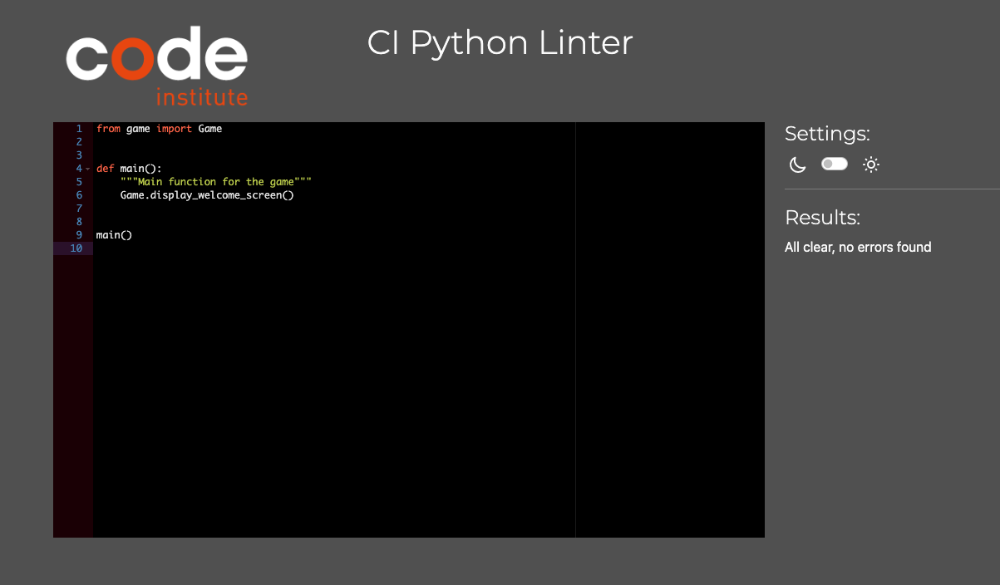

# my little Snek

my little Snek is a game inspired by the popular virtual pet called Tamagotchi. In this game, you have a virtual pet which has different needs that you need to take care of.
The objective is to have the pet last as long as possible. Throughout the game, the pet evolves into bigger and bigger stages. 

Since the game was developed using the programming language Python, I deemed it fitting to make the pet a snake. 

The deployed game can be found here: [my little Snek](https://my-little-snek.herokuapp.com/)

## Table of Contents
- [my little Snek](#my-little-snek)
  - [Table of Contents](#table-of-contents)
  - [Features](#features)
    - [User Stories](#user-stories)
    - [Implemented Features - MVP](#implemented-features---mvp)
        - [Display Welcome Screen](#display-welcome-screen)
        - [Start New Game](#start-new-game)
        - [Load Existing Game](#load-existing-game)
        - [Display Game](#display-game)
        - [Run and progress over time](#run-and-progress-over-time)
        - [Accept non-blocking user input](#accept-non-blocking-user-input)
        - [Pet Functions](#pet-functions)
        - [Autosave in regular intervals](#autosave-in-regular-intervals)
        - [Validate input](#validate-input)
      - [Additional Implemented Features](#additional-implemented-features)
        - [Tutorial Screen](#tutorial-screen)
        - [Going back to the Welcome Screen after quitting the game](#going-back-to-the-welcome-screen-after-quitting-the-game)
    - [Potential Future Features](#potential-future-features)
  - [Design](#design)
    - [Flowchart](#flowchart)
    - [Technologies](#technologies)
      - [Libraries](#libraries)
    - [Class Model](#class-model)
      - [Pet Class](#pet-class)
      - [Game Class](#game-class)
      - [Datahandler Class](#datahandler-class)
    - [Data Storage](#data-storage)
    - [Potential for Refactoring](#potential-for-refactoring)
  - [Testing](#testing)
    - [Bugs](#bugs)
      - [Fixed Bugs](#fixed-bugs)
      - [Known Bugs](#known-bugs)
    - [Validation](#validation)
    - [Manual Testing](#manual-testing)
  - [Deployment](#deployment)
  - [Credits](#credits)

## Features

### User Stories

1. As a new user I want to have a pleasant experience when opening a game
2. As a returning user I want to be able to recognize the program I have visited before
3. As a new and returning user, I want to know what input options I have
4. As a new user, I want to be able to start a game
5. As a returning user, I want to be able to continue a game from a previous session
6. As a user, I want a personalized experience
7. As a user, I want a clear interface where I can see the game status and the input options at any time
8. As a user, I want to see how the game progresses
9. As a user, I want to be able to interact with the game at any time
10. As a user, I want to be informed of incorrect input

### Implemented Features - MVP

| **Feature**                                                       | **Solves User Story** |
|-------------------------------------------------------------------|-----------------------|
| [Display Welcome Screen](#display-welcome-screen)                 | 1, 2, 3               |
| [Start New Game](#start-new-game)                                 | 4, 6, 7               |
| [Load Existing Game](#load-existing-game)                         | 5                     |
| [Display Game](#display-game)                                     | 7                     |
| [Run and Progress Over Time](#run-and-progress-over-time)         | 8                     |
| [Accept Non-Blocking User Input](#accept-non-blocking-user-input) | 9                     |
| [Pet Functions](#pet-functions)                                   | 9                     |
| [Autosave in Regular Intervals](#autosave-in-regular-intervals)   | 5                     |
| [Validate Input](#validate-input)                                 | 10                    |

##### Display Welcome Screen 

At the start of the program, the game displays a welcome screen that shows different options to choose from. 

The welcome screen's purpose is to make sure the player feels welcome and a returning player recognizes the game from previous sessions. 

The options the player is presented with are to start a New game, Continue an existing game or to Read the tutorial. The upper case letters, which are also highlighted in a light green color, are the commands the player can use to make their choice. 

##### Start New Game 

If the player chooses the option to start a new game, they are asked to choose a name for their new pet. 
The input is validated to only accept a name made up of letters and a length between 2 to 10 characters. See more about validation in the [section below](#validate-input). 

The idea is that the user bonds a little more with the pet if they can give it a name of their choosing, as opposed to having a random name or unnamed pet. It also personalizes the game experience for the user. 

After the player has input the pet's name, the program will [display the game](#display-game).

##### Load Existing Game

If the player chooses the option to continue an existing game, they are asked to provide the 6 digit ID of the pet. 
The input is validated to check if it conists of exactly 6 characters and to also check if all characters are numbers. See more about validation in the [section below](#validate-input). 

The ID is generated automatically on a new game with 6 random digits to make sure people cannot just guess someone else's pet's ID. 

After the player has input the pet's ID, the program will give appropriate feedback about the input.

It will then proceed to [display the game](#display-game).
The player also has the option to go back to the main menu by entering "Q". 

Offering a player the option to continue a game they had started earlier, requires to save the data somewhere. In the case of my little Snek, the data is saved in a Google Sheet and retrieved from there or updated when needed. I will talk more about this below in the section about [Data Storage](#data-storage).

##### Display Game

The main game display is split into two essential parts:

1. Display the Pet and it's properties
    - Name
    - Age
    - ID
    - Stage
    - Hunger
    - Poop
    - Sadness
2. Display Input Options
    - Pet Functions
    - Quit Game

This way, the player has all the information they need at their disposal at any point during a running game. 

The pet display is using text art and emoji characters to make it more pleasing and easier to grasp the content. 

The input options are highlighted in the same way as in the Welcome Screen, to ensure consistency and to make it easy to see which options are available.

##### Run and progress over time

The core gameplay is based on the idea that the pet has needs that get more urgent over time, and that are not perfectly predictable either. 

For example a real pet would be hungry at a certain point and would need to be fed. It wouldn't starve right away, but it would get hungrier over time. The same goes for the droppings of a pet. It would need to poop eventually, but it's not an exact science when that will happen. 

In that sense, the Snek pet behaves similarly. As time passes, the game evaluates the "needs" or properties of the pet and on every evaluation, there is a chance for the pet to get hungry, poop or get sad. I will call the moment for the evaluation a "tick" going forward. So, on every game tick, the pet is evaluated and the properties may or may not change. 

The ticks are also what determines the abstract unit of age. The pet's age is how many ticks it has been alive for while the game was open. Quitting the game also stops the ticks, therefore it pauses the ageing of the pet. 

I will go more into detail about this functionality when I talk about the [game class](#game-class). 

##### Accept non-blocking user input

Another important part of the core gameplay is that the user can interact with the game and the pet at any time without interrupting the ticks. 
The game should listen to input without pausing the rest of the game. 

So, the player can see the properties and react appropriately to the needs of the pet, by using the [Pet Functions](#pet-functions) mentioned below. 
The player can also decide to quit the game at any time, which will update the pet in the Google Sheet. 

##### Pet Functions

The interaction with the pet is needed to manage the properties of the pet and to prevent it from dying. 

The pet has three functions that counteract the three main properties rising, which are: 
1. Feed -> reduces hunger
2. Pet -> reduces sadness
3. Clean -> reduces poop

When the player uses any of these functions, the corresponding pet property will be updated and the player receives some feedback from the game that is supposed to elicit a positive emotional response. 

Feeding:

Cleaning:

Petting:

After a short delay to give the player time to read the feedback, the game display updates to display the current properties. 

If two interactions are done directly after one another, the game queues them automatically and proceeds to run the functions one after the other. 

##### Autosave in regular intervals

In order to make sure that the stakes are somewhat real and also to make sure that a player can actually continue a game where they left off even if they don't properly quit the game, there is a function to automatically save the game every 5 ticks. 

The autosave is not done on every tick to reduce the number of API calls towards the Google API. 

The user gets a message every time the game is saved. 

##### Validate input

For the User Experience, it is not only important to make sure the user knows what input they can make, but also to inform the user if input was not correct and in which way. 

There are different parts of the program where input is validated and it is validated in different ways. 

1. Pet name validation

    The pet name can be between 2 and 10 characters. On input, the game checks whether the input consists of alphabetic characters only and it checks whether the length is within 2 and 10 characters. 
    
    The game gives appropriate feedback to the player if they enter non-alphabetic characters or if the name is too short or too long. 

    

2. Pet ID validation

    The pet ID has to be a numeric sequence of 6 digits. On input, the game checks whether the input has the correct length and it checks whether all characters are numbers. 
    
    It gives appropriate feedback to the player if the format is incorrect, but also if the ID could not be found, even if the format is correct. 

    Incorrect length:

    

    Incorrect characters:

    

    ID not found:
    
    

3. Game Choice validation and Game Input validation

    The game choice input in the welcome screen accepts only the letters N, C and R. 
    The game input during the game accepts only the letters F, C, P and Q. 

    The input can be both upper or lower case. Any other input lets the player know that it is invalid. 

#### Additional Implemented Features

Features that were added additionally to the MVP are the following:

##### Tutorial Screen

The tutorial screen or game instruction screen is there to inform the player what the game is about and how to play it. I consider it not part of the MVP, since the game is relatively simple and virtual pets are not uncommon. However, I believe it is almost a must-have, because it makes the beginning a little clearer for the player and explains the premise and gameplay, especially for players who are unfamiliar with virtual pets. 

##### Going back to the Welcome Screen after quitting the game

After quitting the game, the player is redirected to the welcome page and can decide to start a new game or load another game if they want. This is a feature that was added simply for a nicer user experience, but it is not directly impacting gameplay. 

### Potential Future Features

There are numerous ways to extend the game or add to it:

- Extend the pet class to have more than one kind of pet
  - At the moment, the game only has the Snake pet, but it could be extended to have different kinds
  - This could be something that is unlocked by getting the snake to maximum growth
- Adding achievements
  - The player could be awarded achievements for different scenarios they reach, e.g.
    - Certain age reached/growth stage reached
    - Letting the pet almost die (properties at 4, 4 and 5)
    - etc.
- Adding sounds as feedback to the user, e.g. when the snake is fed
- Adjusting input to accept whole words as well as leading characters
- Adding a pet cemetery screen, where all deceased pets can be memorized similar to a Hall of Fame

## Design

This section will cover mostly technical design decisions. 

One non-technical aspect I want to mention is that I updated the provided files for the mock terminal website in a couple of ways:

1. I added a background image that is thematically connected, showing some snake skin
2. I changed the "Run Program" button color to match the terminal output color 
3. I repositioned and resized the terminal window. 

I did these things to make the website a little more visually pleasing for the user, but none of this has any effect on the game itself. 

### Flowchart

Before starting to write any code, I mapped out the main functions for the MVP in a flowchart of the game:

During the development of the program, I deviated from the flowchart, so the flowchart is not completely up to date on how the program works. But it is still a good representation of the base concept. 

### Technologies

For this project, I used Python 3.9.13. 

To display the project in a browser, I used the mock terminal provided by Code Institute, which is written in HTML, CSS and JavaScript. 

For hosting the code and for version control, I used Git/GitHub.

To deploy the live project, I used Heroku. 

#### Libraries

For the different functionalities I wanted to have in the game, I used different Python libraries. I have separated them into the Standard libraries and the Custom libraries:

Standard Libraries used:
- os -> Used to clear the terminal
- random -> Used to generate random numbers for ID generation and chance of property changes
- threading -> Used to create simultaneous threads for non-blocking user input and "ticking" to progress the game
- time -> Used in several places to have a delay on functionalities (time.sleep()), used in the ticking function 

Custom Libraries used:
- colorama -> Used to print different colors in the terminal to make the experience more visually pleasing and to highlight input options
- emoji -> Used to display emojis for the pet's properties
- gspread -> Used to access a Google Sheet to store the pet data
- google.oauth2.service_account -> Used to authenticate towards Google's API
  
### Class Model

I decided early on during the development process that this project would benefit a lot from Object Oriented Programming. I created three classes that handle different parts of the game and which I separated into corresponding Python files for better readability of the code. 

#### Pet Class

The first class I created was the Pet class. This class is used to initialize the Pet object in each game. It contains and initializes all properties needed for the pet as well as all functions controlling these properties. 

The Pet class has the following attributes:
| **Attribute**         | **Source**               | **Function**                                                                                                |
|-----------------------|--------------------------|-------------------------------------------------------------------------------------------------------------|
| name                  | User Input               | Name of the pet                                                                                             |
| id                    | Datahandler class method | Used to load a pet in a continued game                                                                      |
| birthdate             | time.ctime() method      | Generated at instantiation of object                                                                        |
| type                  | Default: snake           | Currently no function, can be used to distinguish between different types of pets if implemented            |
| age                   | Default: 0               | Set to default at instantiation of new game increases by 1 on each tick                                  |
| hunger, poop, sadness | Default: 0               | Set to default at instantiation of new game chance to increase by 1 on each tick                         |
| stage                 | Default: 0               | Set to default at instantiation of new game changes at set intervals and determines the image of the pet |
| dead                  | Boolean, default: False  | Set to default at instantiation of new game set to True when pet is evaluated dead                       |

The Pet class has the following methods:
| **Method**            | **What it does**                                                                                                            |
|-----------------------|-----------------------------------------------------------------------------------------------------------------------------|
| feed()                | decreases hunger                                                                                                            |
| clean()               | decreases poop                                                                                                              |
| pet()                 | decreases sadness                                                                                                           |
| get_hungry()          | increases hunger                                                                                                            |
| defecate()            | increases poop                                                                                                              |
| get_sad()             | increases sadness                                                                                                           |
| die()                 | sets a deathtime and deletes the pet from the alive sheet and adds it to the deceased sheet                                 |
| evaluate_properties() | runs get_hungry(), defecate() and get_sad() at a chance of 20%                                                              |
| evaluate_lod()        | evaluates whether 2 of the three properties hunger, poop and sadness are equal to 5  if yes, this sets self.dead to True |

I was considering refactoring the methods that have repeating code in the Pet class, namely feed(), clean(), pet() into "decrease_property()" and get_hungry(), defecate() and get_sad() into "increase_property()". However, I have gotten feedback on a code review that it has benefits that the method name is so descriptive and non-generic, making the code very nicely readable and therefore decided to leave it as is. 

#### Game Class

The second class I created was the Game class. Many methods in the class were initially created as functions, before I decided to move to an object oriented approach with the game functions. 
The Game class is used to initialize the Game object in each game. It contains only one instance attribute, which is called _is_ticking and is set to False on instantiation. 

The Game class has the following methods:
| **Method**                   | **What it does**                                                                                                                                                                                                                                                              |
|------------------------------|-------------------------------------------------------------------------------------------------------------------------------------------------------------------------------------------------------------------------------------------------------------------------------|
| clear()                      | used to clear the terminal                                                                                                                                                                                                                                                    |
| display_welcome_screen()     | displays the welcome screen                                                                                                                                                                                                                                                   |
| display_tutorial()           | displays the tutorial screen                                                                                                                                                                                                                                                  |
| display_game()               | displays the game                                                                                                                                                                                                                                                             |
| save_game()                  | used to save a new game or update existing game calls the corresponding Datahandler methods                                                                                                                                                                                |
| _tick_time()                 | used in the ticking thread calls pet.evaluate_lod() sleeps for 10 seconds then calls pet.increase_age() and pet.evaluate_properties() also calls save_game() on every 5th tick                                                                                    |
| _get_input()                 | used in the non-blocking input thread accepts different input options and calls the appropriate pet functions or quit_game()                                                                                                                                               |
| start_new_game()             | asks for a pet name calls validate_name() calls Datahandler.generate_id() calls time.ctime() initializes a new pet with the id and name and date starts the ticking and input threads respectively                                                             |
| validate_id()                | tries to convert every character in the string to int checks the length of the string raises and excepts Errors on wrong inputs                                                                                                                                         |
| validate_name()              | checks the string for alphabetic characters checks the length of the string raises and excepts appropriate Errors on wrong inputs                                                                                                                                       |
| validate_game_choice_input() | calls the appropriate functions depending on user input gives feedback to the user about invalid input if anything else is entered                                                                                                                                         |
| quit_game()                  | sets self._is_ticking to False, thus ending the threads after finishing their current loop calls save_game() feedbacks the ID back to the user so they don't forget to write it down deletes the instance of the game goes back to welcome screen after 5 seconds |
| load_game()                  | asks for a pet id, but also accepts q to go back to welcome screen calls validate_id() gets raw data from Datahandler alive file prepares the data initializes the pet object with the data from the file starts the ticking and input threads respectively    |

#### Datahandler Class

The last class I created for the project is the Datahandler class. This class is not instantiated as an object, but consists only of class properties and class methods that can be called without an instance. 

The Datahandler class manages all interaction with the Google Sheet that holds the pet data. 

It has a couple of constants that are defined to set up the connection to the Google API.

It has the following class methods:
| **Method**                   | **What it does**                                                                                                                                                 |
|------------------------------|------------------------------------------------------------------------------------------------------------------------------------------------------------------|
| check_if_id_exists()         | uses the find() method on the alive sheet to check if an ID can be found in the sheet returns True if found and False if not found                            |
| get_pet_from_file()          | iterates over the first column of the alive sheet when it matches the ID, it returns the row the id was found in                                              |
| save_new_pet_to_file()       | appends a row to the alive sheet with the data of the instantiated pet object                                                                                    |
| save_pet_to_file()           | iterates over the first column of the alive sheet when it matches the ID, it updates the row the id was found in                                              |
| generate_id()                | generates a sequence of 6 random digits checks the alive sheet if the ID can be found in it it generates a new ID until it cannot find the ID in the sheet |
| delete_pet_from_alive_file() | iterates over the first column of the alive sheet when it matches the ID, it deletes the row the id was found in                                              |
| save_deceased_pet_to_file()  | iterates over the first column of the alive sheet when it matches the ID, saves the data to an array and appends the data to the deceased sheet               |

### Data Storage

As mentioned above, I used the Google API and a Google Sheet to store the pet data. 
The spreadsheet is separated into to worksheets, which I called the "alive sheet" and the "deceased sheet" throughout this Readme. 

The columns represent the different properties that are saved and each row comprises one saved pet. 
The main difference between the sheets is that the "deceased sheet" has an additional column for the deathdate of the pet. 

The main function of utilizing the sheet is giving the player the possibility to continue the game at any time in several sessions. 

Another potential function is that the data could be used to gain insights into trends. One could easily create reports and charts on the number of players/pets, the time players tend to start a new game, how many players tend to neglect their pets and how long they play the game. 

I want to stress that no sensitive personal data is stored in the sheet, but merely game data, thus making it perfectly anonymous. 

### Potential for Refactoring

There are a couple of things that could definitely be improved in the code and I want to mention them here. These improvements would not influnece the gameplay, but only how readable and "clean" the code is. 

- Game Output File

    A next step to specifically improve readability would be to create a file that collects all game output (all print statement content).
    This way, the game code itself would look cleaner instead of being interrupted by long strings and would be easier to follow. It would also be easier to adjust output text in a centralized place instead of having to go through every file separately. 

    Additionally, this could lay the groundwork to change the output format easily if one would want to run the game in a different medium, e.g. as a browser game or with a graphical interface. 

- Balancing File

    In its current state, all balancing is hardcoded in the Pet class and Game class. Examples for this would be the intervals of the ticks, the maximum property (5), the stages at which the pet "grows" or the chance for the properties to increase. 
    All these could be saved into variables into its own file. One could either have them in a Python file, or if one worked with non-developers like Game Designers or similar, this could be stored in a spreadsheet instead so it is easily adjustable for anyone working on the project. 

These are just some of the things coming to mind, I am sure there is even more potential to improve the code. 

## Testing

Testing was done during the whole development period for every feature that was added. 
Additionally, the game was reviewed by numerous people including other students from CI and also family and friends. The feedback collected from these reviews was used to improve the User Experience and remove bugs. 

After the  improvements and refactoring was done, I did another round of thorough testing of every functionality to ensure that everything works as it should. 

### Bugs

#### Fixed Bugs

The following bugs were identified and fixed during development and review phases:

- On load, the game always displayed the first stage of the snake for the first tick
  - Fix: The pet was instantiated with a default value for stage. Added stage to the file data and instantiation of the pet
- If player incorrectly chose to continue a game but didn't know an id, they were stuck in the continue game id input stage
  - Fix: Added the option to go back to main menu instead of inputting an id
- Feedback from pet functions (feed, pet, clean) disappeared too quickly to read
  - Fix: Added a 2 second delay using time.sleep()
- On quitting a game, the game said it saved before the last loop ran, which gave a strange experience
  - Fix: Added a 10 second delay after setting _is_ticking to False using time.sleep() to make sure any actions and feedback to the user happen after the threads are finished

#### Known Bugs

The following bugs are known but remain unfixed:

- Not exactly a bug, but something that feels a little strange is that when pet functions are used, one receives the feedback, but the display updates 2 seconds later now to show the reduced property. I did not change this because I wanted to avoid doing too many display updates, but a change might improve the User Experience here. 
- No other bugs are known at this point.

### Validation

All Python files were checked using the [CI Python Linter](https://pep8ci.herokuapp.com/).

art.py:

datahandler.py:

game.py:

pet.py:

run.py:

### Manual Testing

| **User Story/Feature**                                   | **Testing Method**                                                                                                                                                                                                                                                      | **Expected Outcome**                                                                                                                                                                                                                                                                                                                                                                                                                 | **Test Result**                                                | **Comments**                                                                                                       |
|----------------------------------------------------------|-------------------------------------------------------------------------------------------------------------------------------------------------------------------------------------------------------------------------------------------------------------------------|--------------------------------------------------------------------------------------------------------------------------------------------------------------------------------------------------------------------------------------------------------------------------------------------------------------------------------------------------------------------------------------------------------------------------------------|----------------------------------------------------------------|--------------------------------------------------------------------------------------------------------------------|
| Display Welcome Screen Validate Game Choice           | 1. Navigating to the website, if needed clicking on Run Program 2. Checking that the welcome screen is fully visible in the mock terminal 3. Checking that the welcome screen accepts input 4. Trying different inputs to see if input is validated correctly  | 1. run.py working 2. Seeing the Welcome Screen 3. Being able to enter input of any kind 4. Receiving "Invalid input" message if not using one of the highlighted letters and asking for the input again                                                                                                                                                                                                                     | 1. Pass 2. Pass 3. Pass 4. Pass                       |                                                                                                                    |
| Start New Game Validate Pet Name                      | 1. Typing "n" 2. Trying to input non-alphabetic characters 3. Trying to input 1 letter 4. Trying to input 11 letters 5. Trying to input a name between 2 and 10 letters                                                                                     | 1. Starting a game and being asked for a name input 2. Receiving "Invalid input type" message and asking for the input again 3. Receiving "Invalid input length" message and asking for the input again 4. Receiving "Invalid input length" message and asking for the input again 5. Proceeding to save the pet to file and display the game                                                                            | 1. Pass 2. Pass 3. Pass 4. Pass 5. Pass            |                                                                                                                    |
| Load Existing Game Validate ID                        | 1. Typing "c" to continue a game 2. Trying to input letters 3. Trying to input less than 6 numbers 4. Trying to input more than 6 numbers 5. Trying to input a non-existing ID 6. Trying to input an existing ID                                         | 1. Starting a game and being asked for an id input 2. Receiving "Invalid input type" message and asking for the input again 3. Receiving "Invalid input length" message and asking for the input again 4. Receiving "Invalid input length" message and asking for the input again 5. Receiving "ID doesn't exist" message and asking for the input again 6. Proceeding to load the pet from file and display the game | 1. Pass 2. Pass 3. Pass 4. Pass 5. Pass 6. Pass |                                                                                                                    |
| Display Game                                             | 1. Checking that the whole game is fully visible in the mock terminal 2. Checking that the pet is displayed properly 3. Checking that the input options are displayed properly 4. Checking that feedback to player is visible                                  | 1. No elements are outside of terminal range 2. Seeing pet display, including correct pet stage and pet properties 3. Seeing all input options at the bottom with highlighted characters 4. Making sure feedback is on screen at appropriate times and stays long enough for player to read                                                                                                                                 | 1. Pass 2. Pass 3. Pass 4. Pass                       |                                                                                                                    |
| Run and Progress Over Time                               | 1. Observing the game for a while                                                                                                                                                                                                                                       | 1. Checking that the age changes regularly, and checking that the pet properties change randomly over time                                                                                                                                                                                                                                                                                                                           | 1. Pass                                                        |                                                                                                                    |
| Accept Non-Blocking User Input Validate game input    | 1. Typing "f" to feed the pet 2. Typing "c" to clean the pet 3. Typing "p" to pet the pet 4. Typing "q" to quit the game 5. Typing any other character or full words                                                                                        | 1. Feedback in terminal that pet is fed and decreasing number of mouse emoji 2. Feedback in terminal that poop is cleaned and decreasing number of poop emoji 3. Feedback in terminal that pet is happy and decreasing number of heart emoji 4. Feedback about the game being quit, saved and return to welcome screen 5. Receiving "Invalid input" message                                                              | 1. Pass 2. Pass 3. Pass 4. Pass 5. Pass            |    4. This only happens after the current loop is done, so it takes up to 10 seconds for the game to quit |
| Pet Functions                                            | See section "Accept Non-Blocking User Input" for pet interaction function testing See section "Run and Progress Over Time" for pet property change function testing 1. Waiting for the pet to meet "death" criteria                                               |   1. Feedback in terminal that the pet has died, feedback about the pet being moved to the cemetery, going back to the welcome screen                                                                                                                                                                                                                                                                                          |   1. Pass                                                |                                                                                                                    |
| Autosave in Regular Intervals                            | 1. Observing the game for a while                                                                                                                                                                                                                                       | 1. Checking that the "Saving game" message shows in the terminal in regular intervals                                                                                                                                                                                                                                                                                                                                                | 1. Pass                                                        |                                                                                                                    |
| Validate Input                                           | See sections "Display Welcome Screen", "Start New Game", "Load Existing Game" and "Accept Non-Blocking User Input" for validation testing                                                                                                                               |                                                                                                                                                                                                                                                                                                                                                                                                                                      |                                                                |                                                                                                                    |
| Display Tutorial Screen                                  | 1. Typing "r" on Welcome Screen  2. Typing "Enter" on Tutorial  3. Typing other input on Tutorial Screen                                                                                                                                                          | 1. Checking that the tutorial is displayed correctly 2. Seeing the Welcome Screen again 3. Also takes one back to the Welcome Screen, since any input followed by enter is accepted                                                                                                                                                                                                                                            | 1. Pass 2. Pass 3. Pass                                  |                                                                                                                    |
| Going back to the Welcome Screen after quitting the game | 1. Typing "q" during the game 2. Observing the quitting sequence 3. Checking Welcome Screen functionality again                                                                                                                                                   | 1. Starting the quitting sequence 2. Feedback about the game being quit, saved and return to welcome screen 3. All input being accepted and validated again                                                                                                                                                                                                                                                                    | 1. Pass 2. Pass 3. Pass                                  |                                                                                                                    |

## Deployment

The project was deployed on Heroku. The following steps were needed to deploy the project:

1. Login to Heroku and go to the dashboard
2. Click on "New"
3. Select "Create new app"
4. Enter the desired app name
5. Choose the desired region 
6. Click "Create app"
7. In the newly created app, go to Settings
   1. Reveal Config Vars
      1. Set CREDS
      2. Set PORT to 8000 - About this setting, I want to add that I only set this because the guide from CI instructed me to do so. I have tried deploying without this setting and it worked without any issues. My mentor advised me to include the setting anyways, since they had heard of issues that other students faced recently connected to this setting. 
   2. In the Settings, select "Add buildpack"
      1. Select python
      2. Select nodejs
8.  Go to "Deploy"
9.  Under Deployment method, choose "GitHub" and connect to the GitHub account
10. Enable automatic deployment from main branch

## Credits

Tutorials/Documentation used:
- [PEP8 Style Guide](https://peps.python.org/pep-0008/) - Used to reference code and naming conventions throughout the project
- [Python time Documentation](https://docs.python.org/3/library/time.html) - Used to reference the time methods needed
- [Python threading Documentation](https://docs.python.org/3/library/threading.html) - Used to reference the threading methods needed
- [Threading example](https://www.simplifiedpython.net/python-threading-example/) - Used to understand how threading works
- [Python Standard Library](https://docs.python.org/3/library/) - Used to identify modules useful to the project
- [gspread Documentation](https://docs.gspread.org/en/latest/) - Used to reference gspread methods
- [colorama Documentation](https://pypi.org/project/colorama/) - Used to reference the colorama methods
- [Understanding non-blocking i/o](https://medium.com/vaidikkapoor/understanding-non-blocking-i-o-with-python-part-1-ec31a2e2db9b) - Used to understand how threading with non-blocking input works
- [Stack Overflow multithreading examples](https://stackoverflow.com/questions/5404068/how-to-read-keyboard-input/53344690#53344690) - Used to understand how threading works

Other Tools used:
- [drawio](https://app.diagrams.net/) - Used for the flowchart
- [Heroku](heroku.com) - Used to deploy the project

Art: 
- [Snake Text Art](https://textart.sh/topic/snake)
- [Egg Text Art](https://textart.sh/topic/egg)

- [patorjk.com](https://patorjk.com/) - Used for the welcome screen font

- [Pixabay](https://pixabay.com/photos/skinned-snakeskin-dandruff-line-394384/) - Used for the snake skin background